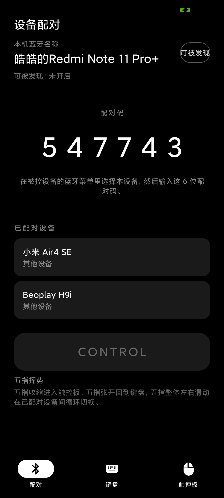
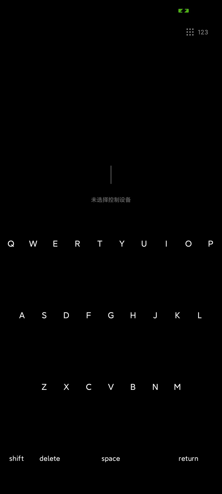
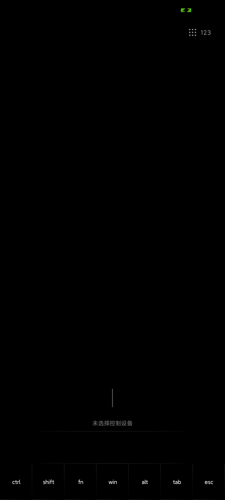

# PocketKeyboard (口袋键鼠)

Turn your Android phone into a **Bluetooth keyboard + trackpad** peripheral: monochrome theme, large minimal surfaces, seamless keycaps, Apple-style design language, and a pure-black OLED-friendly background.

Pair it with an iPad / iPhone / Mac / Windows device and use your phone as their Bluetooth keyboard and trackpad. Multiple hosts can be paired at once, with on-demand switching of the active control target.

**中文版本：[README.md](README.md)**

## Screenshots

| Pairing | Keyboard (87-key TKL) |
| --- | --- |
|  |  |

| Trackpad | Numeric Keypad |
| --- | --- |
|  |  |

## Features

- **Bluetooth HID peripheral**: registers a composite keyboard + trackpad device via the system `BluetoothHidDevice` profile (standard HID report descriptors), so hosts recognize the phone as a Bluetooth keyboard/trackpad
- **Pairing screen**: shows the local Bluetooth name and pairing code, supports pairing with multiple hosts simultaneously; on first connection to a host you choose "Apple device / Other device" to adapt layout and gestures (choice is persisted)
- **CONTROL button**: grey and disabled until a host is connected, then turns black and enters the control UI
- **Five-finger gestures** (global, with animated feedback and text hints):
  - Pinch in → switch to trackpad mode
  - Pinch out → switch to keyboard mode
  - Swipe left/right with five fingers → cycle the active control target among paired hosts
- **87-key keyboard**: TKL layout with Apple and Windows keymaps; black background, white text, seamless keys; press-down visual feedback plus haptics
- **fn combos** (sticky fn, with an on-screen hint):
  - `fn + Space`: cycle screen backlight brightness (iOS-style brightness HUD)
  - `fn + C`: cycle keycap text color (white / orange / red)
  - `fn + S`: cycle keycap font size (small / medium / large)
  - `fn + V`: cycle haptic strength (off / weak / medium / strong), synced with the trackpad feedback
- **Media keys on the F-row**: default to volume, mute, brightness, previous/next track, play/pause; hold `fn` for the literal F1–F12
- **Trackpad screen**: two gesture sets —
  - Windows mode: bottom left/right button zones (with drag), two-finger scroll, pinch-to-zoom (mapped to Ctrl+scroll), three-finger up/down/left/right, four-finger tap = Win key
  - Apple mode: one-finger tap = left click, two-finger tap = right click, two-finger scroll, pinch/rotate (mapped to Ctrl+scroll), three-finger up/left/right
- **Numeric keypad**: minimal "123" toggle at the top-right of the trackpad, opening a bottom sheet with a 4×6 keypad (including 0/00, backspace, return, operators, clear) for heavy numeric input
- **OLED-friendly**: pure black background throughout, white text and icons

## Requirements & Build

- JDK 17, Android SDK (Platform 35, Build-Tools 35.x)
- minSdk 28 (Android 9) · targetSdk 35 · Kotlin 2.x · Jetpack Compose · Gradle 8.11.1 (wrapper included)

```bash
git clone https://github.com/haohaoo3o/PocketKeyboard.git
cd PocketKeyboard
./gradlew assembleDebug
# Output: app/build/outputs/apk/debug/app-debug.apk
adb install -r app/build/outputs/apk/debug/app-debug.apk
```

Or simply open the project directory in Android Studio.

### Tests

```bash
./gradlew testDebugUnitTest   # 159 unit tests (incl. Robolectric Compose UI smoke tests)
./gradlew lintDebug           # static analysis
```

## Usage

1. Install and open the app, grant the Bluetooth permissions when asked
2. Tap "Discoverable" (top-right) on the pairing screen, then **select this phone in the Bluetooth menu of the host device** (iPad / Mac / Windows, etc.)
3. Complete the system pairing flow (some hosts require confirmation on both sides); the CONTROL button turns black once connected
4. On first connection the app asks whether the host is an Apple device or another device, and adapts the keyboard layout and trackpad gestures accordingly
5. Tap CONTROL to enter the control UI; five-finger gestures switch modes / hosts at any time

> Note: the current implementation uses the classic Bluetooth HID profile, where pairing follows the system SSP numeric-comparison flow; the 6-digit code shown on the pairing screen supports hosts that use passkey entry.

## Project Structure

```
app/src/main/java/com/pocketkeyboard/app/
├── MainActivity.kt          # Single Activity: permissions, five-finger gesture layer, page container
├── hid/                     # Bluetooth HID backend: HidDeviceTransport (system profile) + NullHidTransport fallback
├── gesture/                 # Five-finger gesture engine, gesture arbiter (60ms window), HUD, page transitions
├── keyboard/                # 87-key layout model, seamless keycaps, fn combos, HID report engine
├── trackpad/                # Trackpad gestures, Win/Apple gesture sets, numeric keypad sheet
└── ui/                      # MainViewModel, pairing screen, theme
app/src/test/                # 159 unit tests (layout/gesture/HID reports/Robolectric UI)
```

See the in-code comments and the [cross-module contract](app/src/main/java/com/pocketkeyboard/app/hid/HidTransport.kt) for details.

## Known Limitations

| # | Limitation | Status |
| --- | --- | --- |
| 1 | **Unavailable-reason hints not wired to UI** | Reason strings exist (Bluetooth off / registration rejected, etc.) but are not shown yet |
| 2 | **Multi-host switching relies on known registry addresses** | Hosts never connected before are not auto-`connectHost`; select them once on the pairing screen |
| 3 | **HID device registration uniqueness** | The system allows only one app to register the HID device at a time; if taken by another IME, registration retries when the app returns to the foreground |
| 4 | **Pairing code is display-only** | The real SSP number comes from the system pairing dialog |
| 5 | **`AppMode.NUMPAD` does not switch pages** | The keypad is a bottom sheet inside the trackpad page |
| 6 | **Test coverage boundary** | Unit tests cover the pure-logic layer; real Bluetooth connections, gesture feel, and haptic levels need on-device verification; no androidTest yet |

## Permissions

| Permission | Purpose |
| --- | --- |
| `BLUETOOTH_CONNECT` / `BLUETOOTH_SCAN` / `BLUETOOTH_ADVERTISE` | Android 12+ device discovery and connection |
| `BLUETOOTH` / `BLUETOOTH_ADMIN` | Classic Bluetooth on Android 11 and below |
| `ACCESS_FINE_LOCATION` / `ACCESS_COARSE_LOCATION` | Required for scanning on Android 11 and below |
| `POST_NOTIFICATIONS` | Connection status notifications on Android 13+ |

## License

[MIT License](LICENSE)
